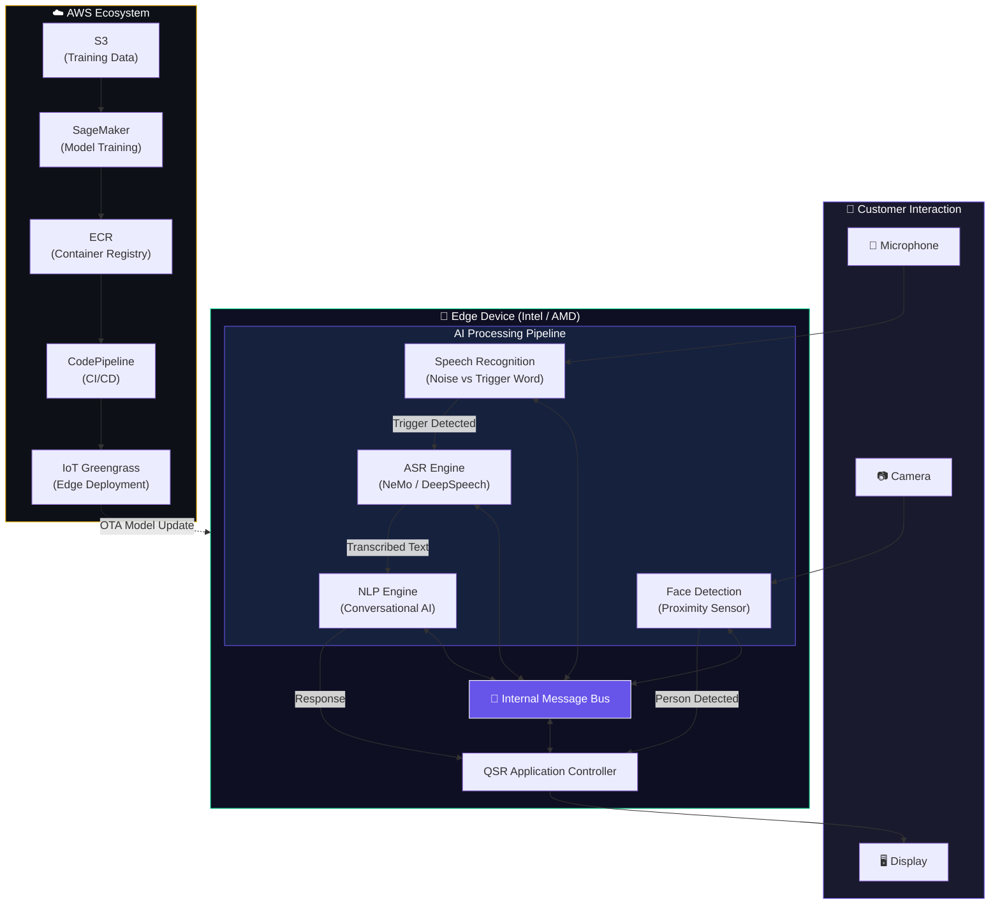
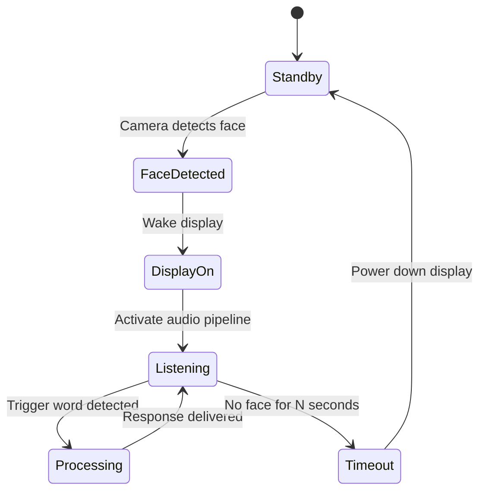
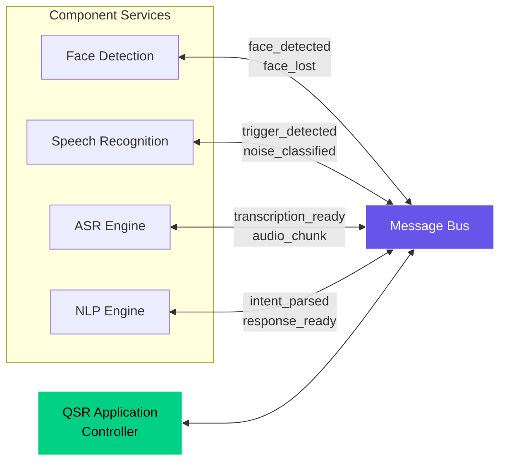
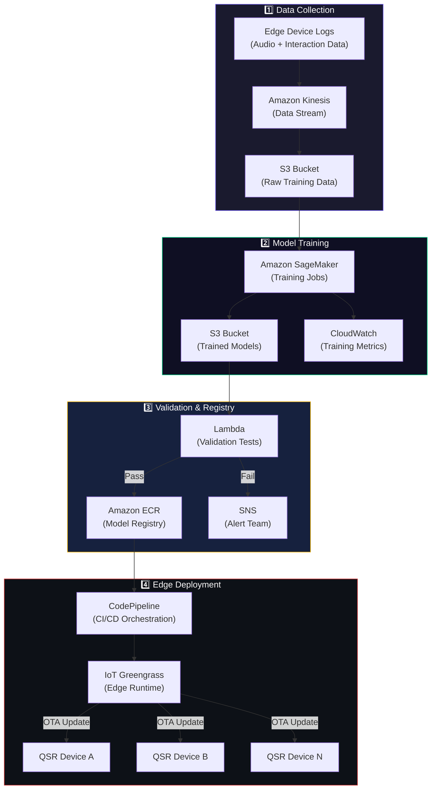
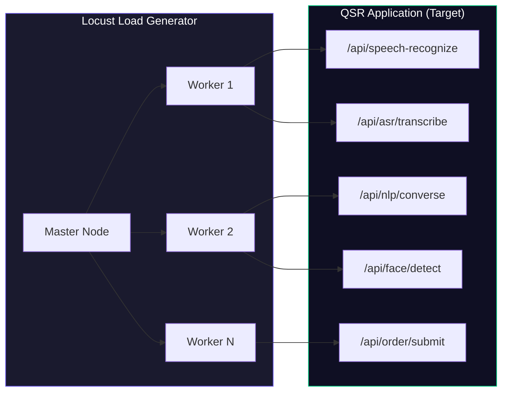

Deploying machine learning models in cloud environments is a well-understood paradigm, but doing so on **commercial off-the-shelf (COTS) edge devices** at physical retail locations introduces unique constraints. In Quick Service Restaurants (QSRs), low latency, privacy-preserving interactions, and zero-reliance on unstable internet connections are critical.

This case study reviews the architecture, component design, and hardware optimization pipelines for an **AI-powered customer experience system** running entirely at the edge in QSR environments.

---

## Architecture Overview

The system enables a hands-free, conversational ordering kiosk or drive-through experience. It runs four tightly coupled AI workloads concurrently on a single local hardware unit, communicating through a high-speed internal event bus to process interactions locally without cloud inference round-trips.



---

## Core AI Components

### 1. Speech Recognition (Noise vs. Trigger Word)
To avoid continuous, resource-heavy speech-to-text processing, the audio pipeline employs a lightweight, always-on binary classifier as its primary gatekeeper. 

```
┌─────────────────────────────────────────────────┐
│              Audio Input Stream                  │
│                    │                             │
│         ┌─────────▼──────────┐                   │
│         │  Pre-processing    │                   │
│         │  (VAD + Noise Gate)│                   │
│         └─────────┬──────────┘                   │
│                   │                              │
│         ┌─────────▼──────────┐                   │
│         │  Trigger Word      │                   │
│         │  │  Classifier     │                   │
│         └───┬──────────┬─────┘                   │
│             │          │                         │
│       ┌─────▼───┐ ┌────▼─────┐                   │
│       │  NOISE  │ │ TRIGGER  │──► Activate ASR   │
│       │ (Ignore)│ │ DETECTED │                   │
│       └─────────┘ └──────────┘                   │
└─────────────────────────────────────────────────┘
```

A **Voice Activity Detection (VAD)** module acts as a pre-filter, discarding frames below a decibel threshold. Remaining signals are passed to a trigger word model (tuned to wake-phrases like *"Hey Dave"*). This structure ensures minimal idle power usage.

### 2. Automatic Speech Recognition (ASR)
Once a wake trigger is verified, the system routes the microphone stream into the ASR engine to convert audio to text in real-time. We benchmarked two primary setups:

* **NVIDIA NeMo (Conformer/CTC)**: Delivers superior transcription accuracy, particularly under noisy conditions, but demands a larger hardware compute profile.
* **Mozilla DeepSpeech (RNN/LSTM)**: Offers a lightweight runtime alternative optimized for lower-power CPUs.


Models are evaluated on **Word Error Rate (WER)** using domain-specific menu corpora, as well as tail latency configurations (P90, P99) to prevent delays during ordering.

### 3. Patented NLP Dialogue Engine
Before modern LLMs, we developed a highly optimized, patented natural language processor. The engine interprets intents and processes entities with near-zero latency, avoiding the high cost and latency of cloud-hosted generative systems.

```
Customer: "I'd like a large combo number 3"
  → Intent:  order_item
  → Entities: {size: "large", item: "combo #3"}
  → Response: "Got it — a large combo number 3. Would you like to add a drink?"

Customer: "Yes, a medium Coke"
  → Intent:  add_item
  → Entities: {size: "medium", item: "Coke"}
  → Response: "Added a medium Coke. Anything else?"
```

### 4. Proximity Face Detection
A custom-trained face detection model serves as the physical wake-up trigger. When a customer walks up to the kiosk display, the camera pipeline wakes the interface and readies the microphone, powering back down to standby when the customer leaves.



This privacy-first pipeline does not perform facial recognition or identity log capture.

---

## Inter-Component Communication

Services run inside independent containers on the edge operating system and coordinate asynchronously through an internal event bus.



---

## Hardware Benchmarking & Optimization

To run these concurrent networks on affordable hardware, we targeted two key compilation ecosystems:

### Intel OpenVINO Compilation
Models are compiled from PyTorch/TensorFlow to **ONNX**, converted to the OpenVINO Intermediate Representation (`.xml` / `.bin`), and quantized to **INT8** using the Post-Training Optimization Tool. Deployments run on Intel Core i7 NUC units utilizing onboard Intel Iris graphics.

### AMD Vitis AI compilation
For FPGA or adaptive SoC-based platforms, models are quantized and mapped to target Deep Processing Unit (DPU) architectures via the Vitis AI compiler.

---

## AWS MLOps Lifecycle

Retraining models on live interaction data and deploying updates Over-the-Air (OTA) is automated using a containerized CI/CD workflow:



Edge devices stream anonymous logs to Amazon Kinesis. Retraining runs in SageMaker, and deployment is securely handled via **AWS IoT Greengrass**, pushing container updates directly to restaurant sites.

---

## Load Testing with Locust

We designed stress-testing scenarios using the **Locust** load-testing library. Distributed worker nodes generate concurrent API requests imitating multiple digital kiosks submitting audio frames and ordering requests.



By profiling latency distributions under Locust loads, we successfully adjusted core threading, CPU pinning, and memory-mapped model cache sizes to prevent lag during lunchtime rushes.

---

## White Paper & Additional Resources

For detailed metrics, device specs, and performance charts, please consult the complete published study:
📄 **[Benchmarking Study for QSRs to Implement AI-Powered CX](https://www.iamdave.ai/whitepaper/benchmarking-study-for-qsrs-to-implement-ai-powered-cx/)**