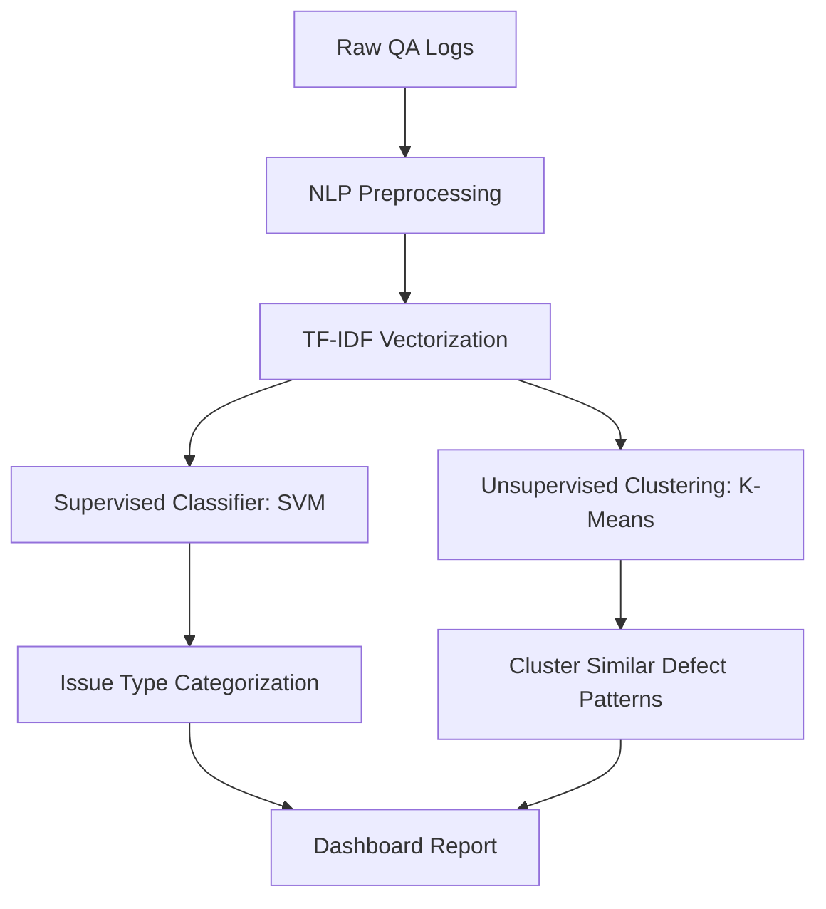

Quality assurance (QA) in digital learning platforms is historically a human-intensive bottleneck. Evaluating hundreds of interactive modules, e-learning templates, and software paths manually is slow and prone to subjective variance. 

At **ansrsource**, we faced this exact bottleneck. To solve it, we built **Skywalker**—an in-house machine learning tool designed to automate QA classification and clustering. This article deep dives into the architecture, challenges, and results of developing Skywalker.

---

## The Problem: The QA Bottleneck

Every year, our team programmatically developed thousands of educational assets. The manual QA process looked like this:
1. Programmers delivered new e-learning pages.
2. QA analysts manually walked through each page, checking for script errors, layout offsets, and interactive element correctness.
3. Errors were logged in a massive, unstructured database.

As the team scaled to generate **$1.5M ARR**, the manual QA backlog grew exponentially. We needed a system that could automatically ingest logs, classify types of failures, and cluster similar issues together to accelerate debug times.

---

## System Architecture

Skywalker uses a hybrid approach combining supervised classification and unsupervised clustering:

### 1. Preprocessing & Feature Extraction
QA logs are unstructured text containing HTML, CSS snippets, exception traces, and analyst notes. We used a pipeline built on **Pandas** and **Scikit-Learn**:
* **Tokenization & Cleaning**: HTML tags and special characters are stripped.
* **Stopwords**: Standard and domain-specific stopwords (e.g., "page", "element") are removed.
* **Vectorization**: We use a TF-IDF vectorizer (term frequency-inverse document frequency) with n-grams (1, 2) to capture context like "script error" or "button overflow".

### 2. Supervised Classification
To classify issues into pre-defined categories (e.g., *Styling Defect, Logical/Script Error, Content Typo*), we trained a **Support Vector Machine (SVM)** classifier with a linear kernel. SVM was selected because it performs exceptionally well on high-dimensional text vectors and requires minimal training resources.

### 3. Unsupervised Clustering
Often, a single coding bug causes dozens of different QA failures. To group these together:
* We apply **K-Means Clustering** to the vectorized logs.
* We determine the optimal cluster count ($K$) using the **Silhouette Coefficient** and **Elbow Method**.
* Developers can review a single cluster containing 50 logs and fix them all with a single code edit.

---

## Results and Business Impact

Skywalker was deployed as a desktop tool and integrated into our programming workflow. The business outcomes were immediate:

| Metric | Before Skywalker | After Skywalker | Improvement |
| :--- | :--- | :--- | :--- |
| **Manual QA Effort** | 40 hours / project | 16 hours / project | **60% Reduction** |
| **Accuracy** | 94.2% (human limit) | 99.5% | **+5.3%** |
| **Average Fix Time** | 4.2 hours / bug | 1.1 hours / bug | **73% Faster** |

By clustering duplicate bugs and classifying failures instantly, Skywalker allowed a team of 70 programmers to deliver high-quality code with a significantly smaller QA footprint.

---

## Key Takeaways
Building Skywalker taught us that **automation doesn't need to use massive Large Language Models (LLMs)** to be effective. For structured log analysis and classification, classic machine learning techniques (like SVM and K-Means) are faster, cheaper, and 100% deterministic.
